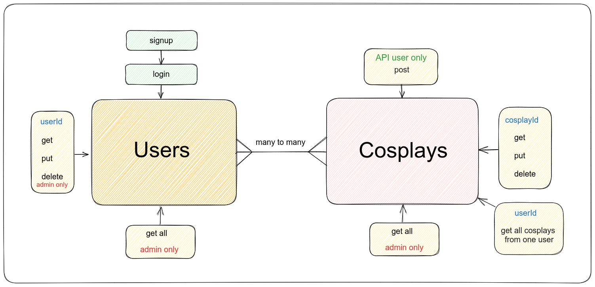

# Cosplay-List

## Final Project für das Modul Backend

- Eine API für Cosplayer die es ihnen ermöglicht den Überblick über ihre Cosplays zu behalten
- Berücksichtigung der Validierung der Userdaten 
- bestimmte Zugriffsrechte mit Authentifizierung
- Verbindung zweier Datenbanken durch das Many to Many Prinzip

### Funktionen der API

User sowie auch Cosplays erstellen, finden, bearbeiten und löschen (CRUD)

- Authentifizierung durch Login
- User können ihre eigenen Cosplays erstellen, sich ausgebenlassen, aktualisieren und löschen
- Admins haben besondere Zugriffsrechte
- Datenschutz ist aktiv durch Passwortschutz

### verwendete Technologien 

- Javascript
- MongoDB
- Node.js
- Express

### Start der API
- npm start

#### Cosplay-List erstellt von 
- Nancy Klemm